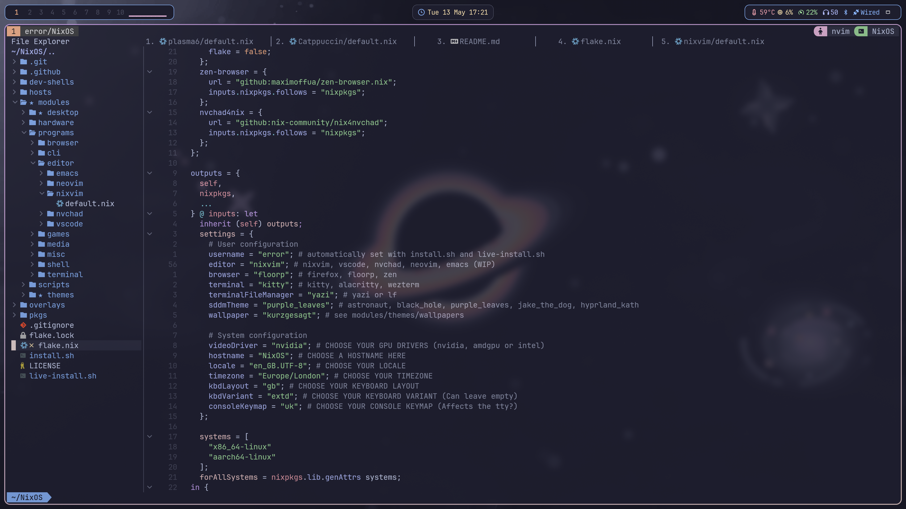

# Nixvim



## Run
```Nix
nix run github:Sly-Harvey/nixvim
```

## Install on NixOS
### Add this to your flake.nix
```Nix
nixvim.url = "github:Sly-Harvey/nixvim";
```
### Then in your home-manager configuration add this
```Nix
home.packages = with pkgs; [
    inputs.nixvim.packages.${system}.default
]
```
